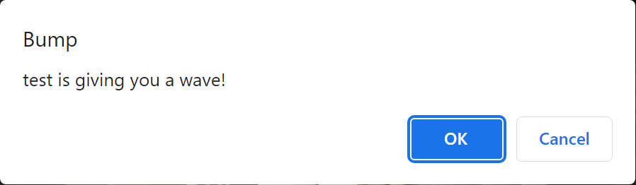
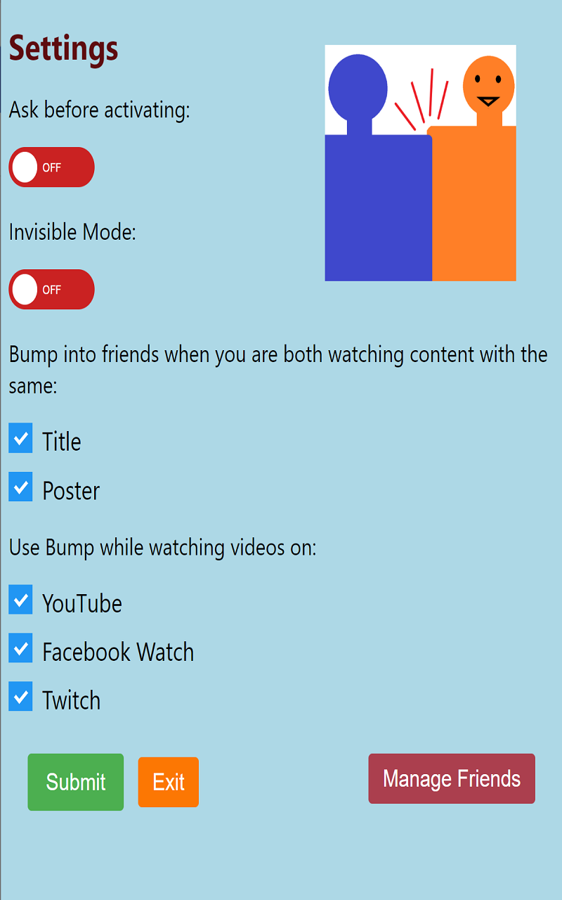
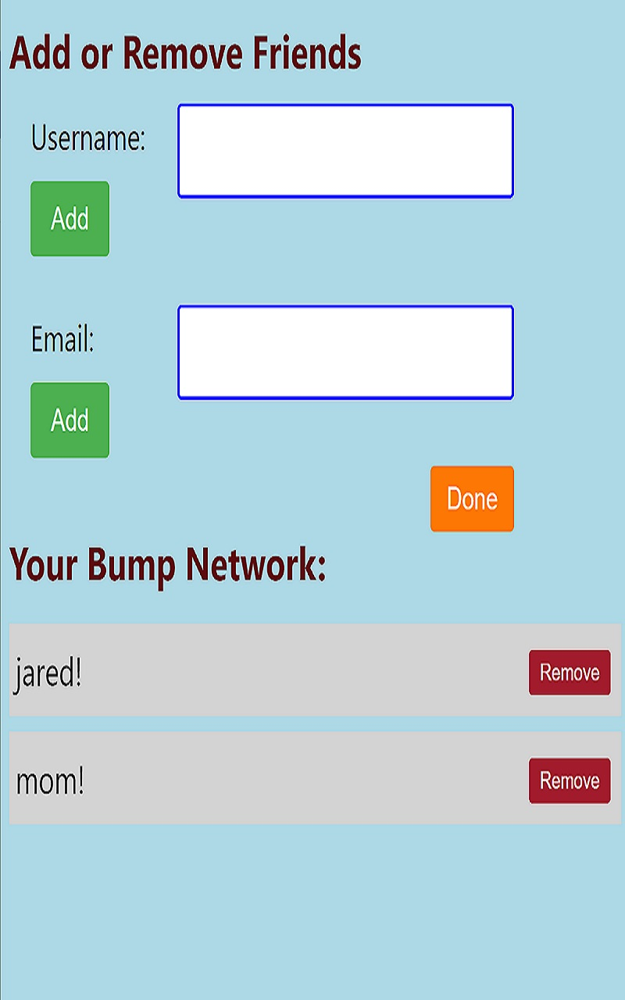

# Bump

Bump is a Chrome extension which allows people to make streaming a social experience. When someone is on Youtube, Twitch, or Facebook Watch and streaming similar content as a friend, they will be alerted to their friend's presence and given the opportunity to wave. This simulates bumping into a friend at a common space like a concert venue.

# Demo Images:

Behavior when a user named "test" and his friend "testUser" are simultaneously watching SNL clips:

Settings Page:

Manage Friends Page:

